## 在世纪互联Azure上搭建持续部署

持续部署 / 持续集成已经火了好几年了，其优势自不必说，不仅提高了开发效率，也减少了手动部署容易产生的错误。Azure从很早开始就支持持续部署，并支持多种代码来源（如下图）：

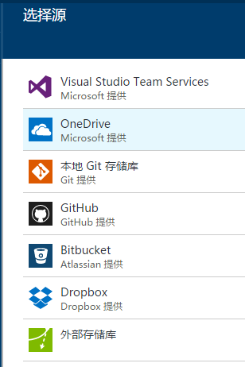

不过可惜的是，国内的Azure因为和外部相对隔离，所以只能支持其中的本地Git存储和外部存储两种方式。我们的代码存储在VSTS中，这样一来就无法直接和VSTS集成，也难以利用到它强大的部署功能（包括自动编译、生成、测试等流程，还能够很容易地进行自定义）。

但还好Azure的App Service的管理网站中，也提供了一套git模式的代码管理（也就是上面多种部署方式中的“本地Git存储库），也可以实现将代码推送到Azure中，然后Azure自动进行生成并进行部署这个过程。这套过程通过Azure App Service的管理后台来实现，这个产品的名字叫Kudu。

以下是配置和使用过程：

**第 1 步**：

在Azure的管理界面（portal.azure.cn）中，在需要开启持续部署的网站中，进入设置项中的部署选项，选择本地Git存储库。

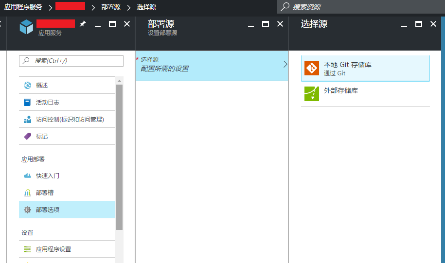

如果在你的Azure中第一次选择本地Git存储库的话，它会要求你输入一个部署用的凭据。需要注意的是，这个凭据不是相对网站的，而是和Azure的管理账号绑定在一起的（也就是说这个Azure中所有的网站使用的都是同样的凭据）。当然，我们也可以使用Azure网站的管理凭据来完成这个部署过程。

在设置之后，进入”属性“界面，可以看到和当前网站相关的一些路径和凭据信息：

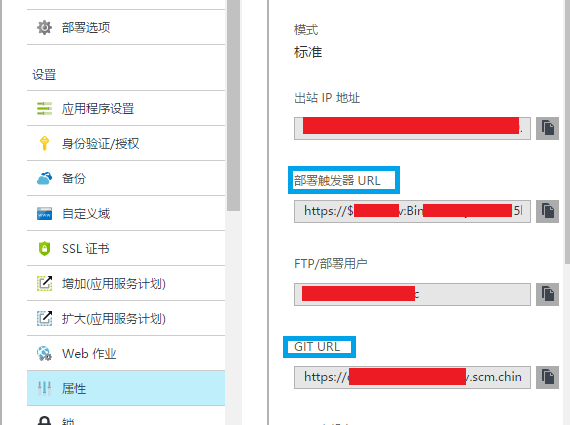

需要注意的就是蓝色框出来的范围：

* GIT URL：这个就是Azure中保存代码的那个Git库地址，每个网站有一个独立的地址，形如：

  ```
  https://[yoursite].scm.chinacloudsites.cn:443/[yoursite].git
  ```

  [yoursite]就是你的网站的标识，scm是Azure针对App Service的管理后台（Kudu）

* 部署触发器URL：当部署完成之后，可以执行我们自己的逻辑，在Kudu中被称为web hook（在部署完成之后可以通过一个钩子来触发外部事件）。具体的逻辑可以详见文末提供的参考资料。这个URL形如：

  ```
  https://[account]:[token]@[yoursite].scm.chinacloudsites.cn/deploy
  ```

  其中[account]和[token]就是我们部署时需要使用的凭据，每个网站有一个独立的凭据，在Kudu中，所有管理操作都使用这个凭据来完成。[account]通常是$[yoursite]的形式，而[token]是一个长达几十位的随机字符串。


**第 1.5 步（可选）**：

作为一个正式的产品，在我们的代码库中通常都会包含多个分支。默认情况下，Kudu只会发布master分支的内容，如果我们要修改这个设置的话，可以使用如下方法（例如针对测试环境，我们需要自动部署develop分支的代码）：

通过Kudu的REST API，可以访问管理后台的设置（`/api/settings`）：

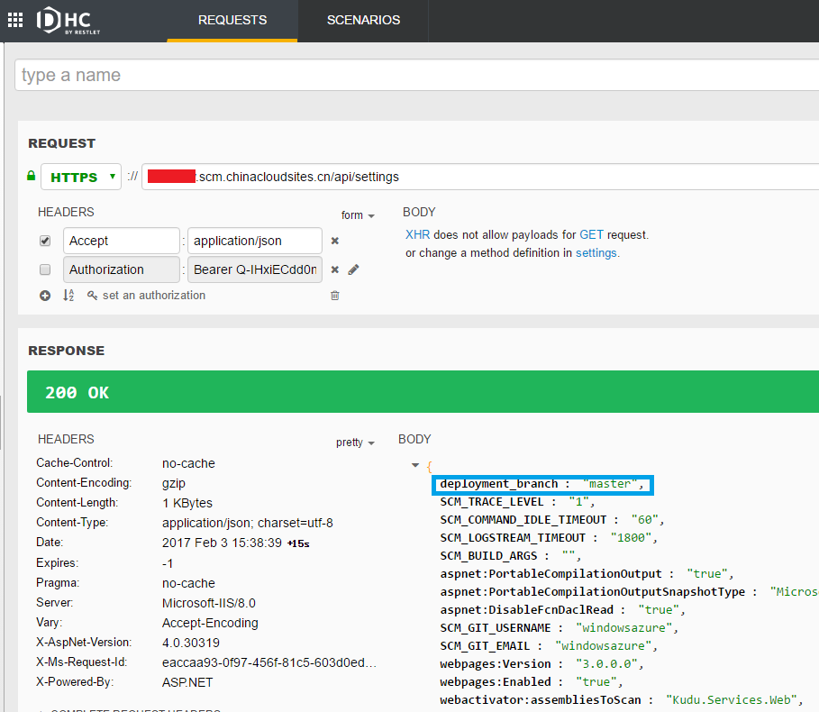

蓝色框出的部分就是部署分支，我们可以通过POST请求将其修改为develop：

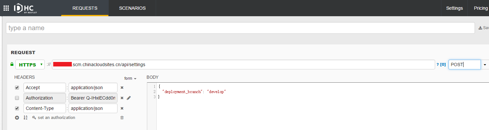


**第 1.8 步**：

默认情况下，Kudu在部署的时候，会选择解决方案中第一个网站类型的项目。如果我们的解决方案中有多个网站项目的话，可以通过发布配置文件指定要生成和部署哪一个，或者更简单的做法，在网站的配置中，使用`PROJECT`作为key来设置网站项目的相对路径，比如`SolutionRoot\WebSite.csproj`。


**第 2 步**：

接下来进行客户端的配置。

由于我们的代码本身就是通过Git模式在管理（宿主在VSTS上），为了将代码发布到Kudu的Git库中，只需要通过以下命令在我们自己机器的Git库中添加一个远程仓库：

```
git remote add azure [GITURL]
```

其中azure是远程仓库的名字，我们可以随便取名；[GITURL]就是上面提到的那个远程代码库的路径，直接复制过来就好。

然后在推送代码的时候，就能够看到多了一个目标（这里我用的vs自带的Git工具，也可以使用其它工具或命令行）：

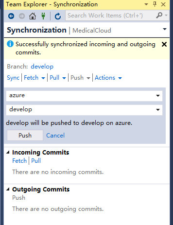

注意推送的目标分支需要和我们之前设置过的`deployment_branch`一致（如果没设置过，默认就是master分支）。


**第 3 步**：

至此，所有配置工作都已完成，我们可以试试看了。

在第一次推送代码的时候，会提示我们输入部署凭据：

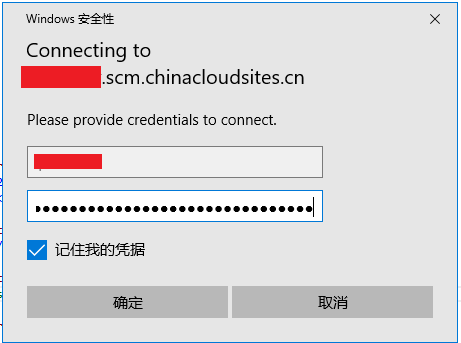

然后，根据在Azure的管理界面中就可以看到此次部署（它会把最新一次的comment也显示出来以作区分）：

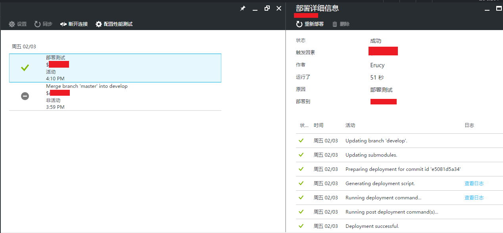

部署的时间长短取决于代码量，因为需要在服务器上进行编译生成。第一次通常都会很慢（我们的代码用了将近10分钟），而进行修改的话相对就会比较快了。

而部署完成后，网站也会相应地更新了。


**第 4 步（可选）**：

因为部署过程可能会持续很久，我们可以通过之前提到的web hook，在部署完成之后发送一封邮件。

Kudu的PostDeployment有很多种实现方式，除了web hook之外，我们也可以向特定的目录中放置一些脚本文件（cmd/bat/ps1）。具体可以参考Kudu的官方文档。在这里，我们使用[Zapier](https://zapier.com)这个网站实现关联部署事件、并发送邮件的功能。

Zapier是一个专门用来集成各种web服务的网站引擎，用它可以拼凑出各种复杂的场景。免费版中支持配置5个引擎，每个引擎只支持一个task（不过对于我们的场景已经足够了）。

注册账号之后，新建一个Zap：


然后在服务中选择Azure App Service：

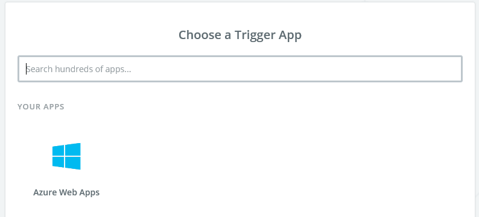

然后选择部署事件：

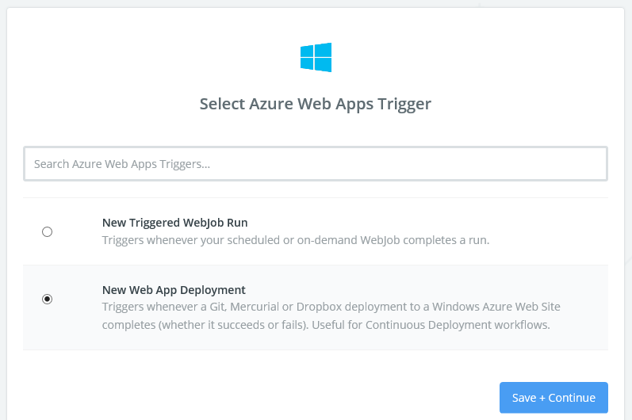

然后输入部署触发器URL（直接从Azure管理界面中复制粘贴进来）：

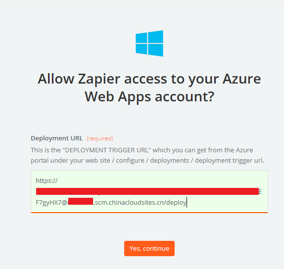

然后测试一下连接是否正常，并给连接一个直观的名字：

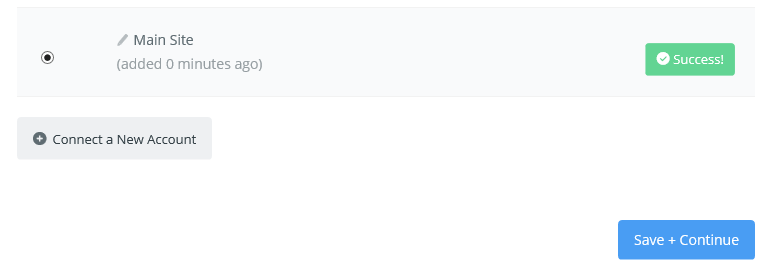

在继续下一步之前，我们需要至少有一次自动部署的成功操作，因为Zapier的后续步骤会通过操作结果获取有哪些属性可以使用。

在Action中，选择Email by Zapier：

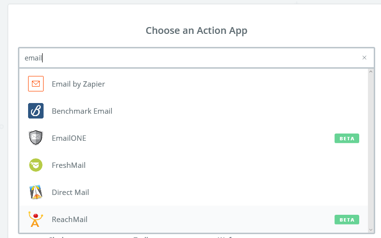

然后配置邮件要发给谁、邮件的主题和正文，可以使用占位符来设计这些内容（占位符来自部署结果）：

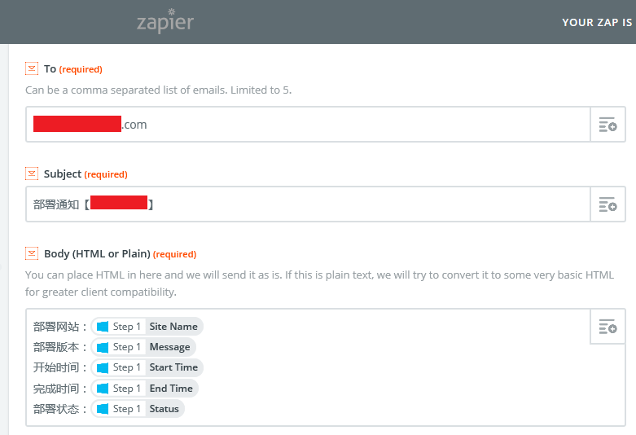

然后就确定、保存、开启这个Zap。再测试一下，部署完成之后，我们就可以收到邮件通知了：

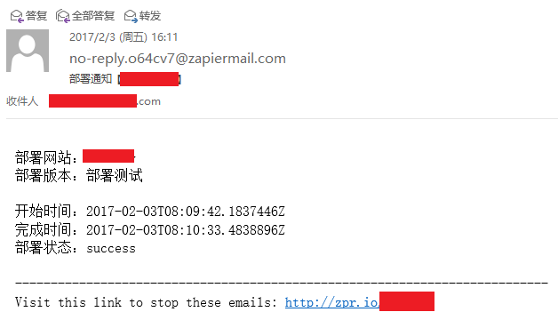

**说明**：

这种部署方式可以生成并部署所有的前、后端代码，包括Web Job。而且如果我们的项目中有web.config tranform的话，它也会自动执行。但是对于需要指定的appSettings或者connectionStrings，建议还是在Azure管理界面中一次性进行配置。


**参考链接**：

https://www.azure.cn/documentation/articles/app-service-deploy-local-git/

https://github.com/projectkudu/kudu/wiki

http://blog.amitapple.com/post/56390805814/deployment-email

